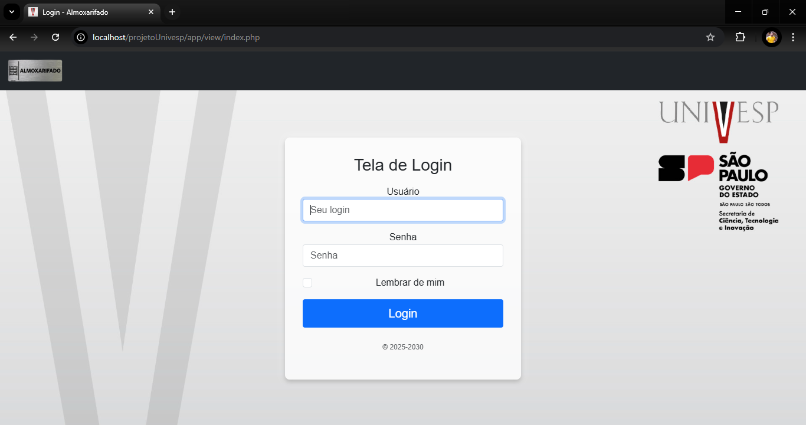
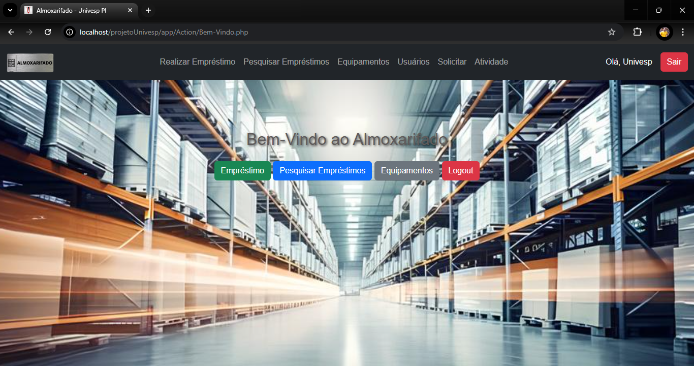
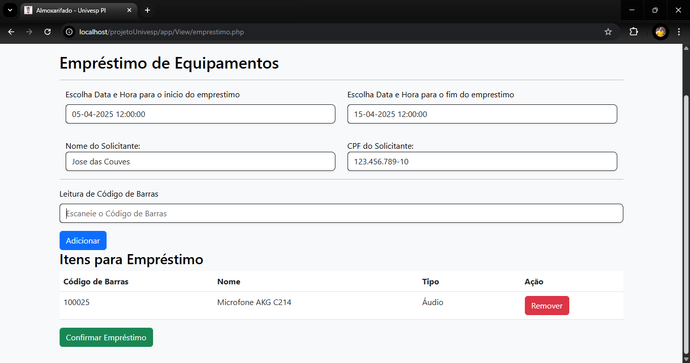

# Projeto Integrador - Almoxarifado Univesp

Este é o repositório do **Projeto Integrador** desenvolvido para a Universidade Virtual do Estado de São Paulo (**Univesp**). O objetivo do projeto é criar um sistema de gerenciamento de almoxarifado, permitindo o controle de empréstimos de equipamentos, consultas e devoluções.

## 📋 Funcionalidades

- **Login e autenticação**: Controle de acesso ao sistema.
- **Empréstimos de equipamentos**: Registro de empréstimos com data e hora.
- **Consulta de empréstimos**: Pesquisa de empréstimos realizados.
- **Gerenciamento de equipamentos**: Listagem e controle de itens disponíveis no almoxarifado.
- **Logout**: Encerramento seguro da sessão do usuário.

## 🛠️ Tecnologias Utilizadas

- **Frontend**:
  - HTML5, CSS3
  - Bootstrap 5
- **Backend**:
  - PHP 7+
  - MySQL
- **Bibliotecas e Ferramentas**:
  - jQuery
  - Flatpickr (para seleção de data e hora)
  - DataTables (para tabelas interativas)
  - SweetAlert2 (para alertas e notificações)

## 📂 Estrutura do Projeto

```plaintext
projetoUnivesp/
├── app/
│   ├── Action/          # Arquivos de lógica e controle
│   ├── Controller/      # Controladores do sistema
│   ├── Model/           # Modelos para interação com o banco de dados
│   ├── View/            # Arquivos de interface do usuário (HTML e PHP)
│   │   ├── img/         # Imagens utilizadas no projeto
│   │   ├── Bem-Vindo.php
│   │   ├── emprestimo.php
│   │   ├── listarEmprestimo.php
│   │   ├── listarEquipamentos.php
│   │   ├── [index.php](http://_vscodecontentref_/1)
│   ├── style/           # Arquivos de estilo (CSS)
│   │   ├── style.css
│   │   ├── bootstrap.min.css
│   │   ├── flatpickr.min.css
│   ├── scripts/         # Scripts JavaScript
│   │   ├── jquery-3.6.0.min.js
│   │   ├── bootstrap.bundle.min.js
│   │   ├── flatpickr.js
│   │   ├── sweetalert2@11.js
├── configuration/       # Configuração do banco de dados
│   ├── connect.php
├── [README.md](http://_vscodecontentref_/2)            # Documentação do projeto
```

## 🚀 Como Executar o Projeto

### Pré-requisitos

- **XAMPP** ou outro servidor local com suporte a PHP e MySQL.
- Navegador web atualizado.

### Passos

1. Clone este repositório:
   ```bash
   git clone https://github.com/seu-usuario/projetoUnivesp.git
   ```
2. Coloque o projeto na pasta `htdocs` do XAMPP:
   ```plaintext
   c:/xampp/htdocs/projetoUnivesp/
   ```
3. Configure o banco de dados:

   - Importe o arquivo SQL (caso exista) no phpMyAdmin para criar as tabelas necessárias.
   - Verifique as credenciais do banco no arquivo `configuration/connect.php`.

4. Inicie o servidor Apache e MySQL no XAMPP.

5. Acesse o sistema no navegador:
   ```
   http://localhost/projetoUnivesp/app/View/index.php
   ```

## 🗂️ Banco de Dados

### Estrutura das Tabelas

#### Tabela `usuarios`

| Campo   | Tipo         | Descrição           |
| ------- | ------------ | ------------------- |
| `id`    | INT (PK)     | Identificador único |
| `nome`  | VARCHAR(100) | Nome do usuário     |
| `email` | VARCHAR(100) | E-mail do usuário   |
| `senha` | VARCHAR(255) | Senha criptografada |

#### Tabela `equipamentos`

| Campo           | Tipo         | Descrição                |
| --------------- | ------------ | ------------------------ |
| `id`            | INT (PK)     | Identificador único      |
| `nome`          | VARCHAR(100) | Nome do equipamento      |
| `codigoDeBarra` | VARCHAR(50)  | Código de barras do item |
| `status`        | ENUM         | Disponível ou emprestado |

#### Tabela `emprestimos`

| Campo             | Tipo         | Descrição                 |
| ----------------- | ------------ | ------------------------- |
| `id`              | INT (PK)     | Identificador único       |
| `solicitante`     | VARCHAR(100) | Nome do solicitante       |
| `equipamentos`    | VARCHAR(100) | Equipamento emprestado    |
| `data_emprestimo` | DATETIME     | Data e hora do empréstimo |

## 📷 Capturas de Tela

### Tela de Login



### Tela de Bem-Vindo



### Tela de Empréstimos



## 👨‍🎓 Equipe

- Bruno Luís Malafaia Siqueira
- Carlos Henrique Garcia Soares
- Daniel Marcelo Nascimento de Lima
- Ednaldo dos Santos
- Francis Resio Torres
- Jefferson Câmara Silva
- Jonathan Vinícius de Oliveira Ferreira
- Juliano Abraão de Carvalho


## 📄 Licença

Este projeto é de uso acadêmico e não possui licença para uso comercial.
